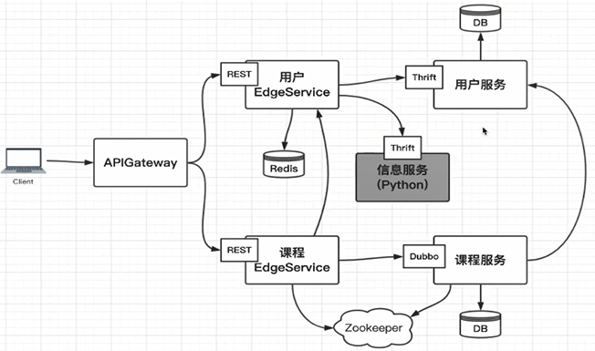

# 微服务系统

## 系统基础结构


# Thrift
## Thrift基础
Thrift软件框架用于可扩展的跨领域服务开发，是一个完整的RPC框架体系

### Thrift支持数据类型

#### 基本数据类型
- bool: 布尔值
- byte: 有符号字节
- i16: 16位有符号整形
- i32: 32位有符号整形
- i64: 64位有符号整形
- double: 64位浮点
- string: 编码或二进制字符串

#### 容器
- list: 有序表，容许元素重复
- set: 无序表，不容许元素重复
- map: 字典

### 结构体
```
struct Work {
  1: i32 num1 = 0,
  2: i32 num2,
}
```

#### 其他
- namespace: 命名空间，避免名字冲突问题，并制定文件生成路径及包名
- required、optional: 规范的struct定义中的每个域均会使用required或者optional关键字进行标识。如果required标识的域没有赋值，Thrift将给予提示；如果optional标识的域没有赋值，该域将不会被序列化传输。
- include: 引入thrift文件 * * *为thrit的文件名
- typedef: 定义需要的结构体

### 传输协议
- **TBinaryProtocol**：是Thrift的默认协议，使用二进制编码格式进行数据传输，基本上直接发送原始数据
- **TCompactProtocol**：压缩的、密集的数据传输协议，基于Variable-length quantity的zigzag 编码格式
- **TJSONProtocol**：以JSON (JavaScript Object Notation)数据编码协议进行数据传输
- **TDebugProtocol**：常常用以编码人员测试，以文本的形式展现方便阅读
### 传输方式
- **TSocket**：阻塞式socker
- **TFramedTransport**:以frame为单位进行传输，非阻塞式服务中使用
- **TFileTransport**:以文件形式进行传输
- **TMemoryTransport**:将内存用于I/O，java实现时内部实际使用了简单的ByteArrayOutputStream
- **TZlibTransport**:使用zlib进行压缩， 与其他传输方式联合使用，当前无java实现
### 服务模型
- **TSimpleServer**：简单的单线程服务模型，常用于测试；
  - 具体说明：接收一个连接，处理这个连接上的请求直到client关闭该连接，才去重新接受一个新连接。因为所有事情都在一个线程且是阻塞I/O， 它仅能同时服务一个连接，其他client不得不等待直到被接收。
- **TThreadPoolServer**：多线程服务模型，使用标准的阻塞式IO；
- **TNonblockingServer**：多线程服务模型，使用非阻塞式IO（需使用TFramedTransport数据传输方式）；
### 编译产生响应语言代码命令
```
./thrift --gen langue tutorial.thrift
```
## Thrift使用

### Python服务端程序
1.新建Thrift文件**message.thrift**
```thrift
namespace java com.micro.thrift.message
namespace py message.api

service MessageService {

    bool sendMobileMessage(1:string mobile,2:string message);

    bool sendEmailMessage(1:string email,2:string message);

}
```
2.使用命令产生对应语言调用api文件
```
thrift --gen py message.thrift
thrift --gen java message thrift
```
3.py服务端调用对应py API产生服务端Socket程序(需pip install thrift)
```python
from message.api import MessageService
from thrift.transport import TSocket
from thrift.transport import TTransport
from thrift.protocol import TBinaryProtocol
from thrift.server import TServer

__HOST = "127.0.0.1"
__PORT = "9090"


# 信息发送接口具体实现
class MessageServiceHandle:
    def sendMobileMessage(self, mobile, message):
        print("sendMobileMessage, mobile:" + mobile + ", message:" + message)
        return True

    def sendEmailMessage(self, email, message):
        print("sendEmailMessage, email:" + email + ", message:" + message)
        return True


# 创建Thrift服务端
if __name__ == "__main__":
    # 定义调用处理类
    handler = MessageServiceHandle()
    processor = MessageService.Processor(handler)
    # 传输端口
    transport = TSocket.TServerSocket(host=__HOST, port=__PORT)
    # 传输方式(帧传输)
    tfactory = TTransport.TFramedTransportFactory()
    # 传输协议
    pfactory = TBinaryProtocol.TBinaryProtocolFactory()
    # 起服务
    server = TServer.TThreadPoolServer(processor, transport, tfactory, pfactory)
    print("python thrift server start")
    server.serve()
    print("python thrift server exit")
```
4.java调用对应Java API产生客户端Socket程序（需maven引入Thrift程序）
```java
package com.micro.useredge.thrift;

import com.micro.thrift.message.MessageService;
import com.micro.thrift.user.UserService;
import lombok.extern.slf4j.Slf4j;
import org.apache.thrift.TServiceClient;
import org.apache.thrift.protocol.TBinaryProtocol;
import org.apache.thrift.protocol.TProtocol;
import org.apache.thrift.transport.*;
import org.springframework.beans.factory.annotation.Value;
import org.springframework.stereotype.Component;

/**
 * 创建Thrift客户端
 * author: mSun
 * date: 2018/10/26
 */
@Component
@Slf4j
public class ServiceProvider {

    @Value("${thrift.server.user.ip}")
    private String userServerIp;

    @Value("${thrift.server.user.port}")
    private Integer userServerPort;

    private enum ServiceType{
        MESSAGE,
    }

    public MessageService.Client getMessageService() {
        return getService(messageServerIp,messageServerPort,ServiceType.MESSAGE);
    }

    public <T> T getService(String ip, Integer port, ServiceType serviceType) {
        TSocket socket = new TSocket(ip,port,3000);
        TTransport transport = new TFramedTransport(socket);
        try {
            transport.open();
        } catch (TTransportException e) {
            e.printStackTrace();
            log.error("【{}】服务连接失败", serviceType);
            return null;
        }
        TProtocol protocol = new TBinaryProtocol(transport);
        TServiceClient serviceClient = null;
        switch (serviceType) {
            case MESSAGE:
                serviceClient = new MessageService.Client(protocol);
                break;
        }
        return (T) serviceClient;

    }
}
```
5.调用
```java
@Autowired
private ServiceProvider serviceProvider;

sendResult = serviceProvider.getMessageService().sendMobileMessage(mobile,code);
```
### java服务端程序（其他步骤同上）
```java
package com.micro.user.thrift;

import com.micro.thrift.user.UserService;
import org.apache.thrift.TProcessor;
import org.apache.thrift.protocol.TBinaryProtocol;
import org.apache.thrift.server.TNonblockingServer;
import org.apache.thrift.server.TServer;
import org.apache.thrift.transport.TFramedTransport;
import org.apache.thrift.transport.TNonblockingServerSocket;
import org.apache.thrift.transport.TTransportException;
import org.springframework.beans.factory.annotation.Autowired;
import org.springframework.beans.factory.annotation.Value;
import org.springframework.context.annotation.Configuration;

import javax.annotation.PostConstruct;

/**
 * 创建Thrift服务端
 * author: mSun
 * date: 2018/10/25
 */
@Configuration
public class ThriftServer {

    @Value("${service.port}")
    private int servicePort;

    @Autowired
    private UserService.Iface userService;

    @PostConstruct
    public void startThriftServer() {

        TProcessor processor = new UserService.Processor<>(userService);
        TNonblockingServerSocket socket = null;
        try {
            socket = new TNonblockingServerSocket(servicePort);
        } catch (TTransportException e) {
            e.printStackTrace();
        }

        TNonblockingServer.Args args = new TNonblockingServer.Args(socket);
        args.processor(processor);
        args.transportFactory(new TFramedTransport.Factory());
        args.protocolFactory(new TBinaryProtocol.Factory());

        TServer server = new TNonblockingServer(args);
        server.serve();
    }
}
```
# Dubbo
## Dubbo基础
### Dubbu核心组件
- Provider: 暴露服务的提供方，可以通过jar或者容器的方式启动服务
- Consumer：调用远程服务的服务消费方。
- Registry： 服务注册中心和发现中心。
- Monitor： 统计服务和调用次数，调用时间监控中心。
- Container：服务运行的容器。  
(https://github.com/apache/incubator-dubbo-spring-boot-project)  
(http://dubbo.apache.org/zh-cn/docs/user/quick-start.html)
## Dubbo基础使用
## Dubbo基础使用
### Dubbo Api
**DemoService** 接口使用
```java
package com.demo.dubboapi;

public interface DemoService {
    String sayHello(String name);
}
```
### Dubbo Provider
1.**pom**依赖
```
<dependency>
    <groupId>com.alibaba.boot</groupId>
    <artifactId>dubbo-spring-boot-starter</artifactId>
    <version>0.2.0</version>
</dependency>
<dependency>
    <groupId>com.demo</groupId>
    <artifactId>dubbo-api</artifactId>
    <version>0.0.1-SNAPSHOT</version>
</dependency>
```
2.**application.properties**
```
# Spring boot application
spring.application.name = dubbo-provider-demo
server.port = 9090
management.port = 9091

# Service version
demo.service.version = 1.0.0

# Base packages to scan Dubbo Components (e.g., @Service, @Reference)
# have a bug : Using the default configuration 'base-package' will cause the service to start abnormally(0.2.0)
dubbo.scan.basePackages  = com.demo.dubboprovider.service

# Dubbo Config properties
## ApplicationConfig Bean
dubbo.application.id = dubbo-provider-demo
dubbo.application.name = dubbo-provider-demo

## ProtocolConfig Bean
dubbo.protocol.id = dubbo
dubbo.protocol.name = dubbo
dubbo.protocol.port = 12345

## RegistryConfig Bean
dubbo.registry.id = my-registry
dubbo.registry.address = N/A
```
3.**DemoServeiceImpl**接口服务实现
```java
package com.demo.dubboprovider.service;

import com.alibaba.dubbo.config.annotation.Service;
import com.demo.dubboapi.DemoService;

/**
 * author: mSun
 * date: 2018/10/30
 */
@Service(
        version = "${demo.service.version}",
        application = "${dubbo.application.id}",
        protocol = "${dubbo.protocol.id}",
        registry = "${dubbo.registry.id}"
)
public class DemoServiceImpl implements DemoService {

    @Override
    public String sayHello(String name) {
        return "Hello, " + name + " (from Spring Boot)";
    }
}
```
4.启动类同一般SpringBootWeb启动
### Dubbo Consumer
1.**pom**引入同上
2.**application.properties**同上
3.**DemoConsumer**
```java
package com.demo.dubboconsumer.controller;

import com.alibaba.dubbo.config.annotation.Reference;
import com.demo.dubboapi.DemoService;
import org.springframework.web.bind.annotation.RequestMapping;
import org.springframework.web.bind.annotation.RequestParam;
import org.springframework.web.bind.annotation.RestController;

/**
 * author: mSun
 * date: 2018/10/30
 */
@RestController
public class DemoConsumer {

    @Reference(
            version = "${demo.service.version}",
            application = "${dubbo.application.id}",
            url = "dubbo://localhost:12345")
    private DemoService demoService;

    @RequestMapping("/sayHello")
    public String sayHello(@RequestParam String name) {
        return demoService.sayHello(name);
    }

}
```
4.启动类同一般SpringBootWeb启动

